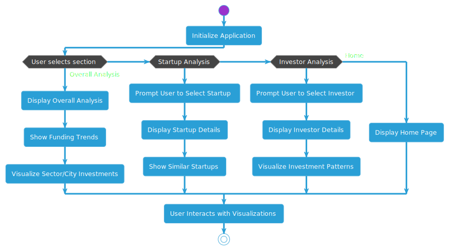

# Streamlit Indian Startup Funding Data Visualization

Welcome to the Streamlit Indian Startup Funding Data Visualization project! This project aims to provide comprehensive visualizations and analysis of the Indian startup funding dataset using Pandas, Plotly, and Streamlit. It offers interactive plots and informative tooltips to explore various aspects of startup investments and investors.

## Table of Contents

- [Project Overview](#project-overview)
- [Installation](#installation)
- [Dataset](#dataset)
- [Website Structure](#website-structure)
    - [Section 1: Overall Analysis](#section-1-overall-analysis)
    - [Section 2: Startup Analysis](#section-2-startup-analysis)
    - [Section 3: Investor Analysis](#section-3-investor-analysis)
- [How to Use](#how-to-use)
- [Contributing](#contributing)
- [License](#license)
- [Contact](#contact)

## Project Overview

This project offers a sophisticated analysis of the Indian startup ecosystem, leveraging advanced data visualization techniques. It aims to provide stakeholders with deep insights into funding trends, investor activities, and startup performance. Utilizing Streamlit for an interactive user experience, alongside Pandas and Plotly for data manipulation and visualization, this project stands as a pivotal tool for entrepreneurs, investors, and analysts interested in the Indian startup landscape.

The main objectives of this project are:

1. Perform an overall analysis of the startup funding ecosystem in India.
2. Enable analysis of individual startups based on user selection.
3. Provide insights into individual investors based on user selection.

## Installation

To run the project locally, follow the steps below:

1. Clone the GitHub repository:

   ```
   git clone https://github.com/yesbhautik/IN-StartupFunding-analysis.git
   ```

2. Navigate to the project directory:

   ```
   cd IN-StartupFunding-analysis
   ```

3. Install the required dependencies using pip:

   ```
   pip install -r requirements.txt
   ```

4. Run the Streamlit app:

   ```
   streamlit run app.py
   ```

5. The app should now be running locally. Open your web browser and access the following URL:

   ```
   http://localhost:8501
   ```

## Dataset

The dataset, curated by Sudalai Rajkumar on Kaggle, encompasses a wide array of data points on Indian startups, including investment rounds, investor details, funding amounts, and sector information. This rich dataset serves as the foundation for our in-depth analysis, enabling users to uncover trends and patterns in the Indian startup ecosystem.
You can find the dataset at the following Kaggle link: [Indian Startup Funding Dataset](https://www.kaggle.com/datasets/sudalairajkumar/indian-startup-funding)

Ensure that you download the dataset and place it in the appropriate directory within the project structure.

## Website Structure

The website consists of three main sections: Overall Analysis, Startup Analysis, and Investor Analysis. Each section offers different visualizations and insights based on the selected data.

### Section 1: Overall Analysis

The Overall Analysis section provides an overview of the startup funding ecosystem in India. It includes the following components:

- **Month by Month Analysis**: This component displays key metrics such as total investments made so far, maximum investment, average investment, and total funded startups.
- **Month-on-Month Line Graphs**: This component presents line graphs for the total amount of funding and total funded startups month-on-month.
- **Total Funded Indian Startups**: This line graph illustrates the total number of funded Indian startups month-on-month.
- **Top 10 Most Funded Sectors**: This horizontal bar graph shows the top 10 sectors with the highest funding amounts between 2015 and 2020.
- **Top Investors**: This horizontal bar graph showcases the top investors based on

 their investment values.
- **Top 10 Most Funded Startups**: This 3D bar graph represents the top 10 most funded startups in startup funding year-on-year.
- **Top 10 Most Funded Cities**: This horizontal bar graph displays the top 10 cities with the most startup funding.
- **Top 10 Most Funded Round Types**: This horizontal bar graph presents the top 10 round types in startup funding.
- **Heatmap**: This heatmap visualizes the funding amount by year and month.

### Section 2: Startup Analysis

The Startup Analysis section allows users to select a specific startup from a dropdown menu and provides detailed insights about that startup. The section includes:

- **Selected Startup Information**: This component displays various metrics for the selected startup, including total investments, sector, subsector, funding stage, and investors.
- **Similar Startups**: This section presents a list of similar startups that belong to the same sector as the selected startup.

### Section 3: Investor Analysis

The Investor Analysis section enables users to select a specific investor from a dropdown menu and explore their investment activities. The section includes:

- **Selected Investor Information**: This component provides information about the selected investor and their recent investments, including the date of investment, startup name, vertical, city, and other investors involved.
- **Biggest Investments**: This bar chart showcases the biggest investments made by the selected investor in terms of amount.
- **Most Invested City**: This pie chart illustrates the most invested city by the selected investor in terms of amount.
- **Most Invested Sector**: This pie chart presents the most invested sector by the selected investor in terms of amount.
- **Most Invested Subsector**: This pie chart displays the most invested subsector by the selected investor in terms of amount.
- **Most Invested Investment Type**: This pie chart represents the most invested investment type by the selected investor in terms of amount.
- **YoY Investment**: This line graph shows the year-on-year investment trend of the selected investor in terms of amount.
- **Investors in Similar Sectors**: This component lists four investors who have invested in the same sectors as the selected investor.

## Workflow Diagram

The following diagram illustrates the workflow of the Streamlit Indian Startup Funding Data Visualization project:


## How to Use

1. Launch the Streamlit app by following the installation instructions mentioned earlier.
2. Once the app is running, access the provided URL in your web browser.
3. The website will load, displaying the Overall Analysis section by default.
4. Explore the different components and visualizations within each section.
5. To select a specific startup or investor for analysis, use the dropdown menus provided.
6. Gain insights and explore the interactive visualizations to understand the Indian startup funding landscape.

## Contact

For any questions or inquiries, feel free to reach out to me at [Website](https://yesbhautik.co.in/)
